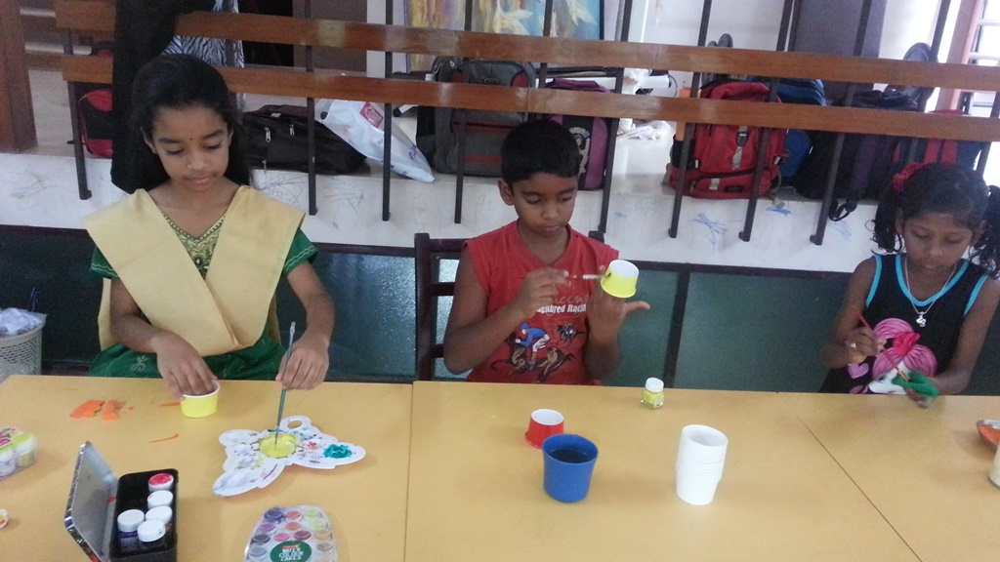

<html>
<title>DEEPSTHAL WEBSITE</title>
<link rel="icon" href="favicon.ico">

<h1><strong> DEEPSTHAL</strong></h1>
<link rel="stylesheet" href="css/style.css">

<body>

<h2><strong>Deepsthal is a learning centre located in</strong> <a href="https://www.google.co.in/maps/place/Pyaar+Foundation-+Deep+Sthal/@11.9430394,79.834898,19.99z/data=!4m8!1m2!2m1!1sdeepsthal!3m4!1s0x3a5363b96a40365d:0xc65f21c986d464f1!8m2!3d11.9431667!4d79.8351258">20, Padmini thottam, Pappammal Koil St, opp. Senganiamman Temple, Kuruchikuppam, Puducherry, 605012</a></h2>

<h2><strong>Founder Of Deepsthal</strong></h2>

<h3><em><li><a href="PK.html">Praveen Kapoor</a> is the founder of deepsthal</li></em></h3>

<h3><li><em>Deepsthal is a learning centre just like <a href="https://www.saice.in/">Ashram.</a></em></li></h3>

<h3><li><em>PK got the idea of doing a school in his dream.</em></li></h3>

<h3><li><em>he thinks everything practically.</em></li></h3>

<h3><li><em>He is kind hearted</em></li></h3>

<h2><strong> Learning structures</strong></h2>

<h3><em><li>We use<a href="https://en.wikipedia.org/wiki/Open_classroom"> open classroom system.</a></li></em></h3>

<h3><em><li>Students study everything practically, we don't memorise our subjects. </li></em></h3>

<h3><em><li>we follow <a href="https://www.nios.ac.in/">NIOS board</a></li></em></h3>

<h3><em><li>We have all the facilities for learning, we have Ipads,Computers,etc.. </li></em></h3>

<h3><em><li>We have enough teachers.</li></em></h3>

<h3><em><li>We give vocational trainings for our students, so that they can have skills for their future </li></em></h3>

<h3><em><li>There is no school uniforms for the students because we want everyone to be in their comfortable dress,they will also learn to choose their own dress colors.</li></em></h3>

<h3><em><li>we take childrens a trip each year.</li></em></h3>

<h3><em><li>We have a period called The dignity of labour.Students clean their school by themselves. By that students learn to keep their souroundings neat & clean.</li></em></h3>

<h3><em><li>student's are not said to bring their bags, their notes are kept here as there is no h.w.</li></em></h3>

<h3><em><li>We provide food to the students (breakfast,lunch,snacks) so, they don't need to bring their food from their home. </li></em></h3>

<h3><em><li>we give exercise practise to our students for girls and boys. we train them in gym,free hand exercises and gymnastics</li></em></h3>

<h2><strong> Learning Experience by the students </strong></h2>

<h3><em><li>We like our teachers very much as they are very friendly with us, they don't shout or beat us.We like the way they make us understand our studies.</li></em></h3>

<h3><em><li>We get positive feeling in this school.</li></em></h3>

<h3><em><li>we have the freedom to learn what we wish to.</li></em></h3>

<h3><em><li>We like organising events.</li></em></h3>

<h3><em><li>In this school we are physically and mentally happy:)</li></em></h3>

<h3><em><li>We are consentrated by the teachers individually, by that we understand better. In our old school, there are 40-60 students in a section, so that we are not consentrated by the teacher but here it doesn't happen.</li></em></h3>

 
<table>
    <tr>
    <td><h2><a href="contact.html">Contact Us</a></h2></td>
    <td><h2><a href="clips.html">,Photo Gallery</a></h2></td>
    </tr>

</table>

</body>
</html>
